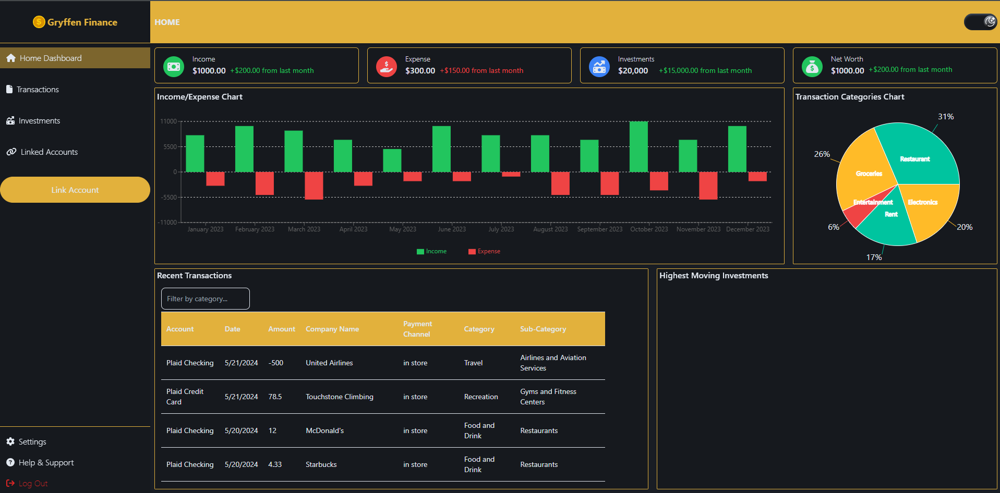
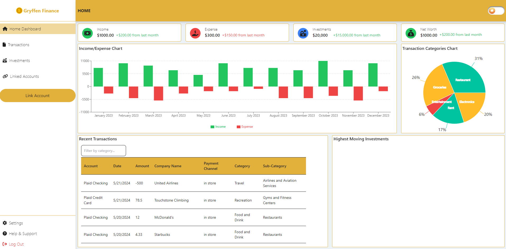

# Gryffen Finance Web App

Personal Finance Application Built with React Typescript, Tanstack (Tanstack Query and Tanstack Table) and Tailwind CSS

## How to Start Project
### 1. Run the Personal Finance Backend Project Locally
### 2. Run npm install
### 3. Run npm run dev
### 4. Register or Log In
    - Your login credentials will only be utilized for getting into the app to receive the mocked data, none of your personal finance information will ever be stored

## Steps For Plaid Link
### 1. Click "Link Account"
### 2. Click "Get Started" and choose Charles Schwab
### 3. Click "Continue to log in"
### 4. Login credentials are unneeded, as my mocked data from Plaid is loaded regardless. Click "Sign In"
### 5. Your mobile number is unneeded. Click "Get code" and you will get to the next step.
### 6. Click "Submit" with the input field empty.
### 7. Choose any number of accounts to link, then click "Continue"
### 8. Accept the terms and conditions and click "Connect accounts"
### 9. You should be able to view the mock transactions in the "Recent Transactions" section of the Home Dashboard

## Dark Mode

### Light Mode

